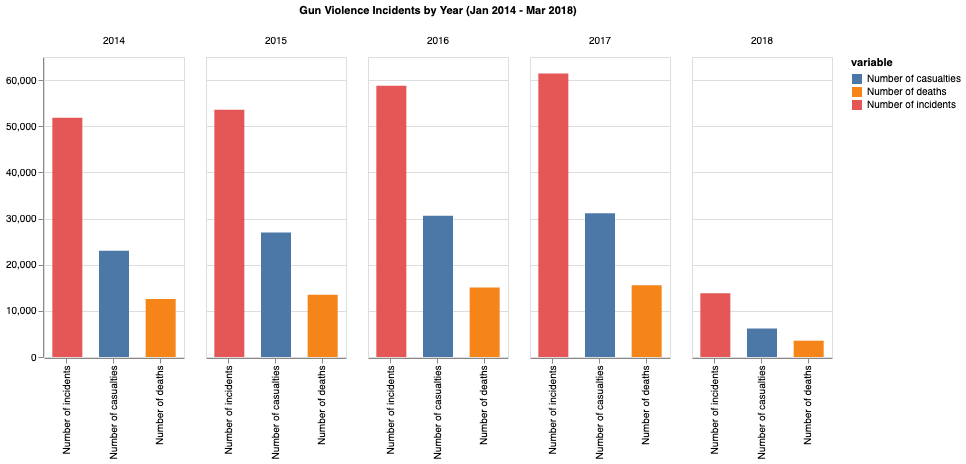
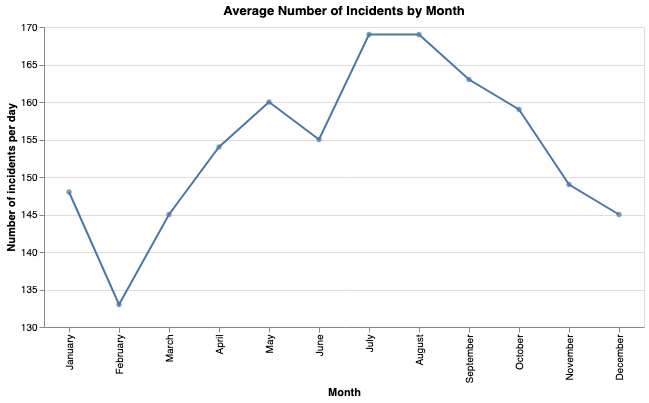
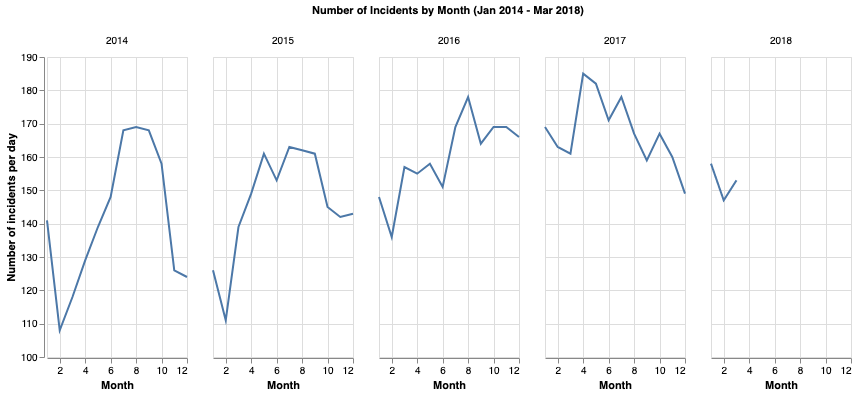

# gun-violence

This project aims to analyse gun violence trends in the United States from January 2014 to March 2018. The data used in this notebook has been obtained from the _Gun Violence Archive (GVA)_, and made available by James Ko on [Kaggle](https://www.kaggle.com/jameslko/gun-violence-data). The data is collected from over 6,500 law enforcement, media, government and commercial sources daily, and uploaded to [their website](https://gunviolencearchive.org) in real-time, as well as used for statistics on their social platforms. Following this analysis, the main findings are outlined below

---
1. The number of incidents, casualties, and deaths, has been increasing drastically every year from 2014 to 2018. There is a roughly 10,000 difference in number of incidents and casualties between 2014 and 2018, while the number of deaths has increased by 3,000.

----
2. On average, the number of incidents by month is declining between August and February, and then increasing back between February and July. There are roughly 35 more incidents per day in July and August than February. 

The trends are however not similar every year, 2016 and 2017 suggesting more uniformity.

